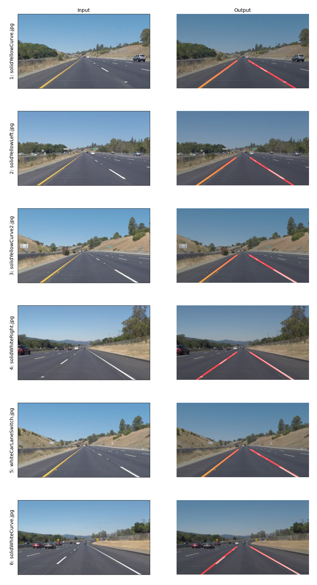

# P1: Finding Lane Lines on the Road

## Objective

The goals of this project are the following:

* Make a pipeline that finds lane lines on the road from images
* Analyze results and possible improvements

## Related files

- `P1.ipynb` : Jupyter notebook that implements the lane finding pipeline
- `output_images` : Sample pipeline output images

## Methodology

The project involved developing a pipeline to identifying road lanes from an image depicting the driver's side view of the road from inside of a car. The pipeline would process one image. To process a road video, the pipeline was simply run on each video frame (image) and then combined into an output video. 

The pipeline for identifying road markings in images are as follows.
1. Use color thresholding to filter for white and yellow pixels
2. Convert the image to grayscale
3. Apply Gaussian blur to remove noise for edge detection
4. Use the Canny algorithm for edge detection
5. Mask the image to remove all edges outside of the region of interest (ROI)
6. Detect the left and/or right lane lines from the ROI using Hough transform and additional post processing
7. Apply the detected lines on the original image

The parameters for steps 1 and 3-6 were determined empirically by examining the results of the pipeline on the images in `test_images`.

The color threshold filter, which is applied to the image in the RGB colorspace, is a combination of two filters (white and yellow) whose outputs were merged using the `cv2.bitwise_or` operation. The merged output is a binary mask that is then applied to the original image.

The region-of-interest (ROI) coordinates are based on the image's height and width to account for different image sizes in the pipeline's input.

### ROI determination
The ROI boundary vertices were determined empirically by examining a few of the `test_images` and having the boundary surround the lane lines of interest, as shown in the figure below.


In order to make the ROI boundary scalable, rather than keeping the vertices as constants, the slope of the right line segment of the boundary was stored instead, as well as a few other parameters:

- `Y_HORIZON_RATIO`: ratio between the horizon y-coordinate (ROI line near the center of the image) and the image height. This parameter was used to both extract the ROI vertices based on the input image, and also compute the lane line end points in the `draw_lines()` function.
- `lane_spread_ratio`: Ratio between the bottom (larger) base of the ROI boundary and the width of the image. This was used to recover the ROI boundary given an input image for lane line extraction.

### `draw_lines()` function modification

In order to determine both the left and/or right lane line to draw on the image, I implemented the following steps for the `draw_lines()` function:

1. Divide the lines into left and right lane lines based on their slopes. Filter out slopes whose values go beyond a certain range.
2. For each lane line, compute the line slope `m` and y-intercept `b` by averaging the `m`s and `b`s of each category's lines. 
3. Compute the end points of each lane line bounded by the top and bottom portions of the ROI boundary.
4. Draw the two lane lines on the input image.

The slope of each input line is calculated and its absolute value is compared to the slope of the right line segment of the ROI boundary, `M_ROI`,

```python
m = (y2 - y1) / (x2 - x1)
if abs(M_ROI - abs(m)) > M_TOLERANCE:
	continue
```

If it exceeds a certain error threshold, `M_TOLERANCE` it is discarded.

Slopes that were not skipped were partitioned into right and left lane lines based on whether their slopes were positive (right) or negative (left) respectively, given an x-y coordinate system where the y-axis is inverted (y pointing down). 

For the lane line endpoints, the y-coordinates are based on the ROI boundary y-coordinates, and their respective x-coordinates were computed using their line parameters `m` and `b`, as shown in the formula below:

```python
x = (y - b) / m
```

Since the `draw_lines()` function is dependent on the ROI boundary, in order to make it scale, the ROI boundary ccompu

## Results

The figure below shows the output at each stage of the pipeline using the `solidYellowCurve.jpg` image.


As shown in Step 2, the color threshold operation was able to filter out most of the pixels not associated with the lane lines. Step 3 removed color information, which didn't seem necessary due to color thresholding. Step 4 was included to help with edge detection. 

Canny edge detection in Step 5 helped to emphasize the line edges The ROI mask in Step 6 helped remove much of the unnecessary edges in the image. Step 7, which combines line segment extraction using Hough transform and line generation using the `draw_lines()` function, was able to generate both the left and right lane lines, in spite of the latter lane not being a solid continuous line. 

Step 8 shows that the extracted lane lines match what's depicted in the original image.

### [Test images](#test-images)

The figure below shows the final output of the pipeline for each of the images in `test_images`.




The pipeline was able to extract lane lines for each of the images.

### Test videos

The following are GIF renditions of the first five seconds of video outputted by running the pipeline on the  `solidWhiteRight.mp4`, `solidYellowLeft.mp4` and `challenge.mp4` videos respectively. Note that the dimensions of the GIF  was reduced in order to save memory.

#### `solidWhiteRight.mp4`


The pipeline was able to track the lane lines across all frames, but there is some noticeable jitter as the position and slope of the lines change slightly across each frame.

#### `solidYellowLeft.mp4`


Results are similar to the `solidWhiteRight.mp4`, although detection of the yellow line across frames was more consistent than the white line on the right.

#### `challenge.mp4`(Challenge video)


The dimensions of this video (1280x720) are larger than the ones in the the previous images/videos (960x540). Although the aspect ratios of the images are similar. The pipeline did not perform as well on this video as in the previous videos, with some frames not being marked (particularly on the left) and others having the line marking close to the lane boundary. This is likely due to the changing lighting conditions that result in the lane line colors blending with the road (e.g. when a tree casts a shadow on the highway).  

## Discussion

From the results shown in the previous section, it seems that the pipeline performs best when the lighting on the road is consistent and the lane lines are continuous. Color thresholding helped to filter out much of the pixels not related to the lane lines, but is not robust to changing lighting conditions across images.

For videos, there is some noticeable jittering of the detected lines across the frames. This is likely due to variations in the slopes. One approach that may minimize the slope variance across frames would be to fit a line based on the points extracted using Hough transform for each of the lane lines.

The lane lines were assumed to be straight, but in reality they can curve near the horizon. Rather than fitting a line to the detected Hough points, a 2nd order polynomial could be fit instead, and the ROI boundary horizon line could be extended to accomodate the curvature.

## Future work

The following are ideas that could help improve the pipeline for detecting lanes.

- Convert the image to HSV and use the H channel for lane extraction
- Fit a line (e.g. using `np.polyfit`) for the left and right lane lines based on the respective line segments/points inferred using Hough transform.
- Use blackbox parameter tuning to choose better parameters for Canny, Hough and other image operations, where the objective is for the pipeline generate lines similar to reference images/videos  in the`examples` directory.

## References

Udacity project: https://github.com/udacity/CarND-LaneLines-P1