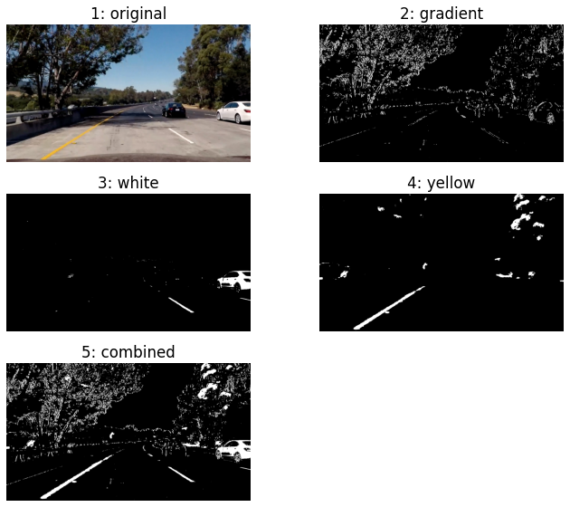
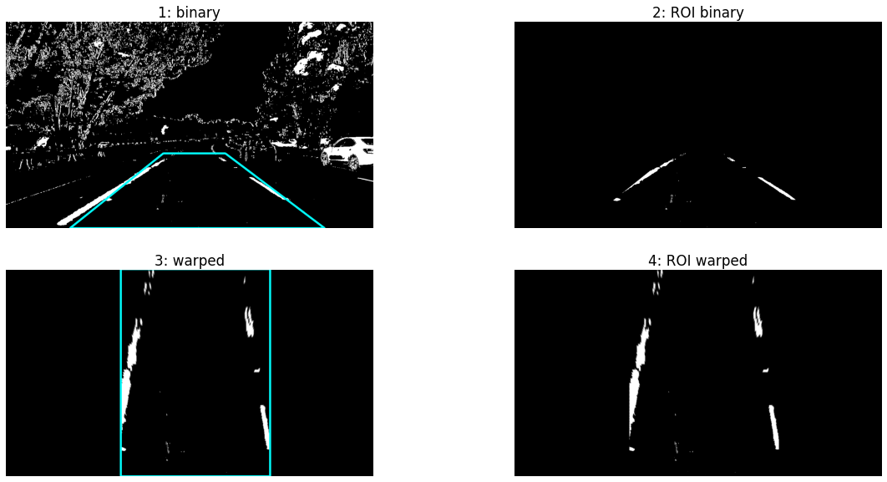
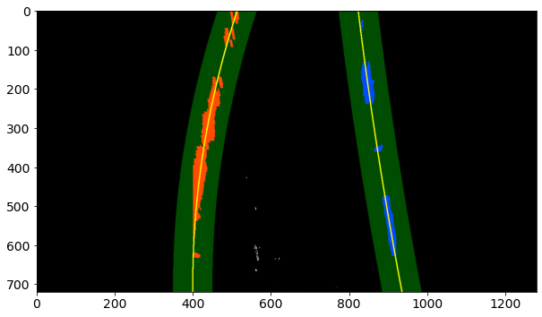
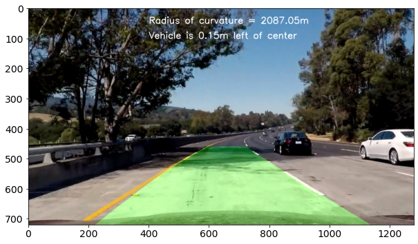
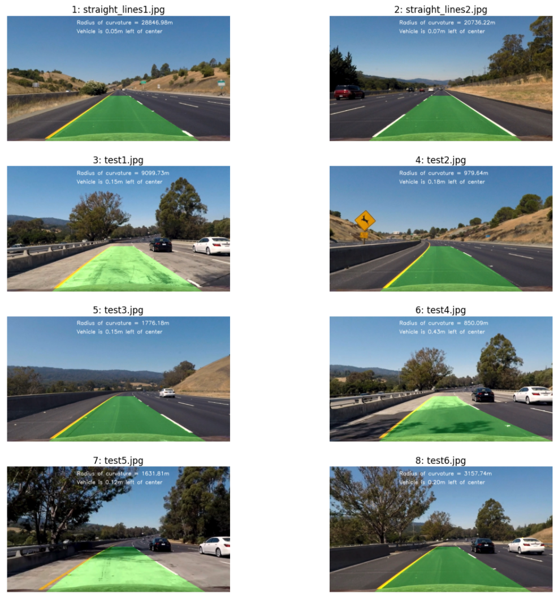
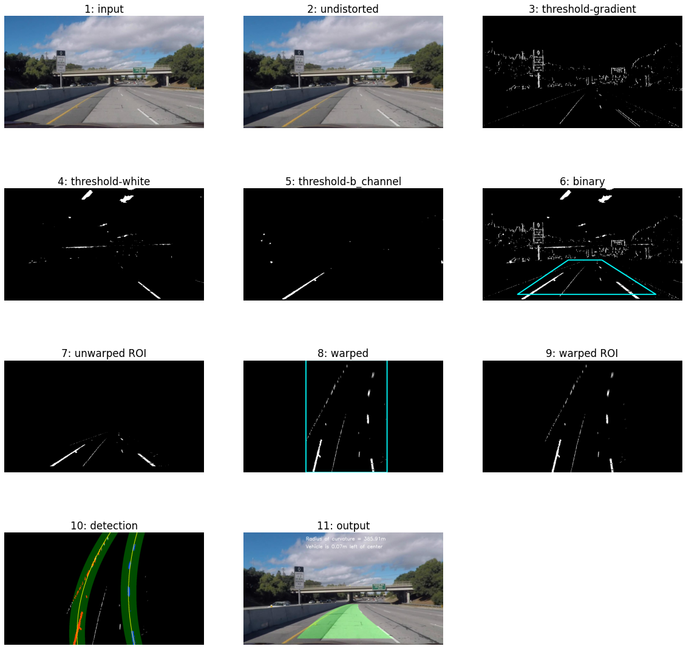

# Project 2: Advanced Lane Finding

## Objective

The objective of this project is to implement a lane finding pipeline that involves the following steps:

* Compute the camera calibration matrix and distortion coefficients given a set of chessboard images.
* Apply a distortion correction to raw images.
* Use color transforms, gradients, etc., to create a thresholded binary image.
* Apply a perspective transform to rectify binary image ("birds-eye view").
* Detect lane pixels and fit to find the lane boundary.
* Determine the curvature of the lane and vehicle position with respect to center.
* Warp the detected lane boundaries back onto the original image.
* Output visual display of the lane boundaries and numerical estimation of lane curvature and vehicle position.

The code that implements the pipeline is under the `lanefinder` directory. The `P2.ipynb` notebook contains lane finding experiments on test images and videos.

## [Rubric](https://review.udacity.com/#!/rubrics/571/view) Points

Here I will consider the rubric points individually and describe how I addressed each point in my implementation.


### Writeup / README

You're reading it!

###   Camera Calibration

The code for this step is contained in `lanefinder/camera.py`.

I start by preparing "object points", which will be the (x, y, z) coordinates of the chessboard corners in the world. Here I am assuming the chessboard is fixed on the (x, y) plane at z=0, such that the object points are the same for each calibration image.  Thus, `objp` is just a replicated array of coordinates, and `objpoints` will be appended with a copy of it every time I successfully detect all chessboard corners in a test image.  `imgpoints` will be appended with the (x, y) pixel position of each of the corners in the image plane with each successful chessboard detection.  

I then used the output `objpoints` and `imgpoints` to compute the camera calibration and distortion coefficients using the `cv2.calibrateCamera()` function.  I applied this distortion correction to the test image using the `cv2.undistort()` function and obtained this result: 


### Pipeline (test images)

#### 1. Distortion correction

To demonstrate this step, I will describe how I apply the distortion correction to one of the test images, `test_images/test5.jpg`.

I first obtained the camera calibration parameters as described in Camera Calibration. Then, I used the `lanefinder.transforms.undistort` function to apply distortion correction using the camera calibration parameters. This function wraps `cv2.undistort`, which returns the undistorted image.

The figure below compares the original image and its undistorted equivalent.


<center><em> Original (left), undistorted (middle) and SSIM per-pixel difference image generated from grayscale equivalents of the original and undistorted images (right).</center>

Since the differences between distorted (original) and undistorted images are visually indistinguishable, I used [SSIM](https://en.wikipedia.org/wiki/Structural_similarity) to compute both the global and per-pixel differences by first converting the distorted and undistorted images to grayscale. The brighter the pixel, the greater the difference.

#### 2. Binary image thresholding

I used a combination of color and gradient thresholds to generate a binary image. For all test images under `./test_images`. The thresholding functions used can be referenced from `lanefinder.pipeline.THRESHOLD_FN_MAP`, which gives the default binary threshold parameters for the lane finder pipeline.

I used gradient-based thresholding using the Sobel operator along the x-axis to highlight the lines in the test image. In order to better highlight pixels belonging to the lane lines however, I used white and yellow color thresholding as well. The code can be found in `lanefinder.transforms.{gradient, white, yellow}_threshold` respectively. 

Color thresholding was done after first converting the test image from RGB to CIELAB colorspace, as the latter appears to provide a better way to locate colors, particularly in the `a` and `b` channels. This was especially useful for highlighting the yellow lane.

The results of the different thresholds are shown below with the original image.


<center><em> Different binary thresholds applied to the undistorted test image. The final (combined) result was generated by applying a bitwise OR opeartion to each of the threshold images. </em></center> 

#### 3. Perspective transform

I first did a sanity check of the perspective transform process by running it through one of the chess images used for camera calibration. The code can be found in `lanefinder.utils.corners_unwarp`, which undistorts the image before applying perspective transform. The result is shown below.


<center><em> Comparison of original chess image (left) and its warped counterpart (right). </em><center>

In order to apply  perspective  transform, I first needed to determine x, y coordinates at the source (input  image) which would then be mapped to x,y coordinates in the output image, which would be called `src_points` and `dst_points`  respectively. For the chessboard image, I based these on the four outer corners.

I then applied a similar approach for the test image, where I had chosen the`src_points` and `dst_points` by visually inspecting several test images. For `src_points`, I created a bounding box around the lane lines, similar to creating a region-of-interest boundary. I chose `dst_points` to be rectangular in order to create a  bird's eye view depiction of the lane  lines. 

The `src_points` and `dst_points` values can be found in `lanefinder.pipeline.WARP_PARAMS`. Perspective transforms is implemented by `lanefinder.transforms.perspective_transform`.

Figure shows the result of perspective transform on the test image.


<center><em> Undistorted test image (left) and its warped counterpart (right). </em><center>

Since all the test images and videos had the same image dimensions, I set the `src_points` and `dst_points` to fixed values, but this can be changed to scale with the image dimensions, which I leave to future work.

To remove additional noise in the image, I also used the `src_points` and `dst_points` as ROI filters on the undistorted binary image and warped binary image respectively. The results are shown below.


<center><em> Warped image progression with ROI filtering on both the unwarped and warped binary images.. </em><center>
 

#### 4. Lane pixels extraction

Lane curvature extraction involved the following steps:

1. Finding initial left and right lane base x-coordinates using a histogram of white pixels along the x-axis
2. Finding lane pixels using search windows starting from the left and right base coordinates

Using the image generated by applying perspective transform on the binary thresholded, a histogram of white pixels along the x-axis (with y = image height) can be obtained. The positions along the x-axis with the largest number of white pixels would be chosen as starting points for the left and right lanes, with the search windows being the left and  right halves of the image respectively. The figure below shows the result.


<center><em> Histogram of white pixels along the x-axis (width) of the image. The two peaks of the histogram are used as starting points for the x-coordinate positions of the left and right lanes respectively. </em><center>

Histogram computation is implemented in `lanefinder.measure.lane_histogram`.

The  lane pixels could then be found using sliding windows starting at the base x-coordinates. The base positions of the next left and right windows would be based on the mean position of white pixels found in the current left and right windows. This approach is implemented in `lanefinder.measure.find_lane_pixels`. 

The result of the sliding window approach on the warped binary test image is shown below.


<center><em> Finding lane pixels using sliding window approach. Search windows are shown in green having a width of 100 pixels. The detected pixels are colored red and blue depicting left and right lane pixels respectively. The yellow lines represent the polynomial curve fitted from the lane pixels. </em></center>

In the above figure, 2nd order polynomial curves for the left and right lanes were also fitted from the left and right pixels respectively using `lanefinder.measure.fit_poly`. Once these curves are available, they can be used in succeeding lane pixel extraction tasks (e.g. next frame in a video) rather than using sliding windows. This is implemented in `lanefinder.measure.find_lane_pixels_from_prior`.

The figure belows shows the result of extracting pixels using prior lane curves.


<center><em> Finding lane pixels using prior lane curves. The search regions are shaded in green. The detected pixels are colored red and blue depicting left and right lane pixels respectively. The yellow lines represent the polynomial curve fitted from the lane pixels. </em></center>

#### 5. Lane curvature and vehicle position

To accurately compute the lane curvature and position of vehicle with respect to the center of the lane, the conversion factor between real distance units (i.e. meters) and pixels needs to be determined. The meters per pixel conversion factors along the x and y axes are specified in `lanefinder.pipeline.METERS_PER_PIXEL`.

Lane curvature is measured using [radius of curvature](https://en.wikipedia.org/wiki/Radius_of_curvature) (ROC). The higher the ROC,  the straighter the lane. The radius of curvature can be computed from the lane polynomial curves. The code that implements lane curvature estimation is in `lanefinder.measure.radius_of_curvature`. Since there are two lanes, the final ROC is computed as the mean of the left and right ROCs.

The vehicle position is measured by computing the difference between the center of the image and the midpoint of the two detected lanes along the x-axis. This step is implemented in `lanefinder.measure.vehicle_offset`.

Test image output for this step is shown in the next section. 

#### 6. Putting it all together

Lane boundary detection, curvature and vehicle position estimation are implemented in `lanefinder.transform.detect_lane_boundary`. The entire pipeline that implements distortion correction all the way to lane boundary detection is implemented in `lanefinder.pipeline.Pipeline`. 

The following is the result of running the end-to-end pipeline on the test image.


<center><em> Output of the lane finding pipeline. The detected lane boundary is overlayed on the undistorted image, with the radius of curvature and vehicle offset from lane center indicated at the top. </em></center>

The pipeline can also generate output images of different stages of the process for analysis, similar to those shown in 1-6 above.

#### 7. Results for all test images

Below is the result of running the pipeline on all of the test images under `./test_images`.


<center><em> Results of running the pipeline on all the test images. </em></center>

The pipeline was able to detect the lane boundaries and overlay them appropriately on the image. It was also able to generate reasonable measurements for ROC and vehicle offset from lane center. For the `straight_lines*.jpg` images, the curvature is expected to have high values for ROC as the straighter the line detected, the greater the radius.


### Pipeline (video)

For detecting lanes in video, the pipeline would use the sliding windows approach to detect lane pixels on the very first frame. The fitted lane curves would then be derived from those pixels, so that succeeding frames could make use of those curves as a prior for identifying new lane pixels. 

To smoothen the detection, the fitten lane parameters derived in each frame are averaged. This is implemented in `lanefinder.pipeline._update_lane_fit`. Another form of lane curve parameter update is done where if the current frame has enough detected lane pixels, the older lane curve parameters are replaced. If there are not enough detected pixels, the older lane curve parameters are averaged with the newly computed one. This is implemented in `lanefinder.transforms.detect_lane_boundary`.

I created a wrapper function in order to run the pipeline on videos. The code can be found in `P2.ipynb` under "Run pipeline on test videos." Using that function, I ran the pipeline on `project_video.mp4`, and the result can be found in [here](./output_videos/output_project_video.mp4).

The pipeline was able to overlay the lane boundary correctly throughout the video, and was able to compute ROC and vehicle offset in each frame. On the straightaway, the ROC is shown to have significantly higher ROC values as expected.

### Discussion

While the pipeline was able to successfully process the test images and project video, there are some limitations, which I enumerate below.

* The `src_points` and `dst_points` for perspective transform are fixed, since the images and videos have the same image dimensions.
* The color and thresholding parameters are determined empirically from the test images and videos (including challenge ones), and may not scale to all types of scenarios (i.e. low light conditions)
* The ROC and vehicle offset measurements are based on assumed pixel-to-meter conversion factors, which may not be accurate.
* The `src_points` boundary does not extend up to the bottom-most part (height) of the image. This was originally done to exclude the vehicle's hood from getting overlayed by the lane boundary. However, shortening the boundary may affect the ROC and vehicle offset calculations.

In addition, the pipeline didn't do so well in the challenge (`challenge_video.mp4`) and harder challenge (`harder_challenge_video.mp4`) videos. This is explained in more detail in the Appendix section.

To address the above limitations, future work on the pipeline could involve the following:

* Create scaling constants for `src_points` and `dst_points` so they can change depending on the image dimensions.
* Consider using the Hough lines technique in Project 1 for fitting initial lane polynomial curves. Filter detected lines using reference slopes for left and right lanes.
* Adjust the `src_points` boundary to extend to the bottom-most part of the image and check the difference in ROC and vehicle offset measurements.
* In the sliding windows approach for detecting lane pixels, if the current window does not contain enough white pixels, continue sliding the window in the direction that the previous windows are veering towards (i.e. use the gradient between windows).

Currently, pipeline would likely not work in cases where image dimensions are different from the test images and videos. Also, the pipeline may do poorly in images that show glare from the windshield or have other artifacts that may be depicted as lines after performing gradient thresholding (e.g. asphalt divide).

## References
Udacity project: https://github.com/udacity/CarND-Advanced-Lane-Lines

The following are additional references I had consulted in building the lane finding pipeline.

- https://medium.com/@tjosh.owoyemi/finding-lane-lines-with-colour-thresholds-beb542e0d839


## Appendix

### Pipeline (challenge video)

Output: [`./output_videos/output_challenge_video.mp4`](./output_videos/output_challenge_video.mp4)

Pipeline parameters:

```python
challenge_pipe = pipeline.Pipeline(
  cam,
  threshold_fn_map={
    'gradient': transforms.gradient_threshold,
    'white': transforms.white_threshold,
    'b_channel': functools.partial(
        transforms.channel_threshold, 
        channel=2, thresh_min=150, thresh_max=255, 
        colorspace=cv2.COLOR_RGB2LAB),
  },
  warp_params=types.WarpParams(
      src_points=np.float32([
        [223, 680],
        [548, 460],
        [764, 460],
        [1110, 680]]),
      dst_points=np.float32([
        [400, 720],
        [400, 0],
        [920, 0],
        [920, 720]]),
  )
)
```

For the challenge video, the pipeline parameters were changed to better fit the problem. In particular, a color threshold was applied to b-channel of the image after it was first converted into CIELAB colorspace. This was to filter out the yellow lane. In addition, the `src_points` and `dst_points` were also changed to account for the difference in relative size of the lane lines.

The pipeline was mostly able to detect the right lane, but had trouble detecting the left lane correctly. One reason is that the barrier on the left was generating a gradient line after applying gradient threshold, which was being detected as lane pixels as it was close to the actual lane lines towards the horizon. The polynomial curves was then being fit with the barrier pixels instead of just the lane pixels. Another cause for error is a line appearing within the lane boundaries after applying gradient threshold on the relevant frames, starting at t=1s of the video. The figure below illustrates the challenge.


<center><em>Challenge video frame t=2s illustrating lane finding difficulties.</em></center>

And the figure below shows images depicting different stages of the pipeline for the above image. 

<center><em>Analysis of challenge video frame at different stages of the pipeline.</em></center>


One way to address the first issue would be to shorten the `src_points` ROI boundary so that it doesn't overlap with the road barrier. However, this approach may not be scalable. Another way would be to add momentum to the sliding windows so that if the minimum pixels without the window is not reached, the next window is chosen based on the gradient of prior windows.

To address the second issue, the effect of gradient threshold could be minimized (i.e. apply a weight) or the gradient threshold image can be AND-ed with the color threshold image instead of OR-ed (i.e. so that the two thresholding techniques would need to agree on which pixels are included). The caveat of the latter approach is that the two thresholds may not always coincide with producing non-zero pixels on the lane lines.


### Pipeline (harder challenge video)

Output: [`./output_videos/output_harder_challenge_video.mp4`](./output_videos/output_harder_challenge_video.mp4)

Pipeline parameters:

```python
pipe = pipeline.Pipeline(
  cam,
  threshold_fn_map={
    'gradient': transforms.gradient_threshold,
    'L_channel': functools.partial(
        transforms.channel_threshold,
        channel=0, colorspace=cv2.COLOR_RGB2LAB, thresh_min=225),
  },
  warp_params=types.WarpParams(
      src_points=np.float32([
        [100, 680],
        [400, 460],
        [764, 460],
        [1110, 680]]),
      dst_points=np.float32([
        [100, 720],
        [100, 0],
        [1020, 0],
        [1020, 720]
      ]),
  )
)
```

The harder challenge video features significantly different environment from the other test images and videos. The setting is in a forested area with a narrow two-lane road and tighter turns. This presented a greater challenge for the pipeline to detect the lanes properly.

To improve pipeline performance, a color threshold working on the L-channel of the CIELAB colorspace was set up. From visual inspection of a frame of a video, it seems that the L channel shows a high intensity for the yellow and white lanes, perhaps due to the bright sunlight depicted in the image.

In the initial frames, the pipeline was able to draw the lane boundary appropriately. However, coming up to the turn, the lane boundary started to diverge from the lane lines. Due to lane curve averaging, the divergence was not too great, and the pipeline still tried to keep the lane boundary within the actual lane lines. However, windshield glare and oncoming vehicles on the other side of the road appeared to have caused a disruption in the lane curve fitting. The worst portions of the video would have lane boundaries appearing as an hourglass shape due to the lane curves overlapping.

