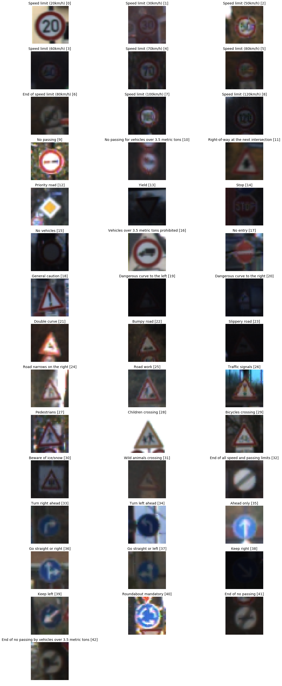
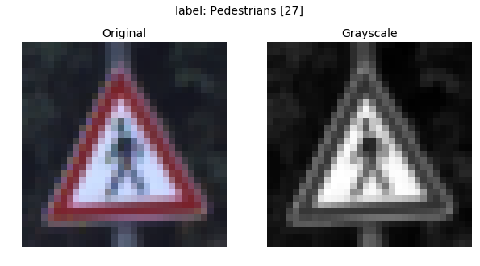
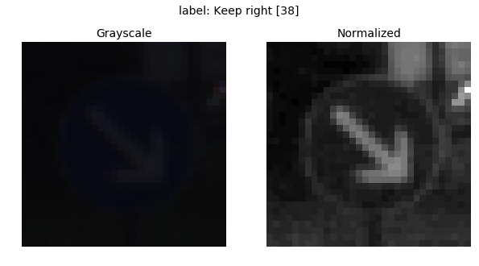

# Project 3: Traffic Sign Recognition

## Objectives

The goals / steps of this project are the following:
* Load the data set (see below for links to the project data set)
* Explore, summarize and visualize the data set
* Design, train and test a model architecture
* Use the model to make predictions on new images
* Analyze the softmax probabilities of the new images
* Summarize the results with a written report

## Rubric Points
Here I will consider the [rubric points](https://review.udacity.com/#!/rubrics/481/view) individually and describe how I addressed each point in my implementation.  

### Writeup / README

You're reading it! and here is a link to my [project code](./Traffic_Sign_Classifier.ipynb).

### Data Set Summary & Exploration

I obtained a basic summary of the dataset using Numpy.

* The size of training set is **34799**.
* The size of the validation set is **4410**.
* The size of test set is **12630**.
* The shape of a traffic sign image is **(32, 32, 3)**.
* The number of unique classes/labels in the data set is **43**.

I then analyzed the label distribution of the training, validation and test sets.


<center><em> Distribution of labels in the training, validation and test sets. The x-axis contains the class names, with the class IDs in square brackets. </em></center>

From the above figure, it appears that there is class imbalance in the training, validation and test sets, but the distribution appears to be consistent across datasets (e.g. majority class of training set is similar to the validation and test sets). The majority class of the training set, "Speed limit (50km/h)," has 2010 examples, while the minority class, "Speed limit (20km/h)," has about 180, or about 11x difference. 

I also examined an example image from the training set for each of the classes, as shown in the figure below.


<center><em> Example image per class with the class name and ID on top (ID in brackets).  For each class, the first image in order of occurence in the training set was chosen. </em></center>

In the above figure, some of the images are quite dark and their features are not very noticeable to the human eye. However, this is just showing one example and other images for each class could have better brightness/contrast.

### Design and Test a Model Architecture

In this section I describe the methodology by which I trained the model.

#### Data preprocessing

##### Grayscale conversion

As a first step, the images would be converted from RGB colorspace to grayscale. While this results in a loss of color information, for this particular problem color does not appear to be very significant as the traffic signs are distinguished based on their features (e.g. number text on signs with a speed limit rather than the color of the text).

The figure below shows the result of grayscale conversion on an arbitrary image in the training set.



<center><em>Grayscale conversion</em></center>

##### Normalization

After converting to grayscale, I used per-image standardization to normalize the images, so that they would have zero mean and unit variance.

<center>X_normalized = (X - mean(X)) / std(X) </center>

I initially used center-pixel normalization without grayscale conversion. However, I noticed that model performance was not improving even after several tweaks to the hyperparameters. After implementing per-image standardization, model performance had improved greatly.

Below is an example of an image before and after normalization.


<center><em>(Left) Example image from training set with low brightness and contrast. (Right) Image after applying normalization. Since the normalized image would have pixel values that are not in the 0-1 range, it needed to be rescaled (from 0-255) in order for `matplotlib` to display it properly.</em></center>

As shown in the figure above, the normalized image appears to have better brightness and contrast than its raw equivalent. The sign features could be more clearly seen.

For the labels, I did not need to do any preprocessing, as TensorFlow has an operation that can convert integer labels into one-hot encodings (`tf.one_hot`) so this could be done in training.

I also shuffled the training set using `sklearn.utils.shuffle`. 

#### Model architecture
The model was implemented using TensorFlow 1.3. I based the model architecture on [LeNet](http://yann.lecun.com/exdb/publis/pdf/lecun-01a.pdf), but also added a dropout layer after flatten layer in order to potentially reduce overfitting. The different layers are described in the table below.

<center><em> Modified LeNet architecture </em></center>

| Layer         		| Description	        					|
|:-----------------:|:---------------------------------------------:|
| Input         		| 32x32x1 Grayscale image |
| Convolution 5x5   | 1x1 stride, valid padding, 6 filters, outputs 28x28x6 	|
| RELU					    |												        |
| Max pooling	2x2   | 2x2 stride,  outputs 14x14x6 	|
| Convolution 5x5	| 1x1 stride, valid padding, 16 filters, outputs 10x10x16 |
| RELU					    |												        |
| Max pooling	2x2   | 2x2 stride,  outputs 5x5x6 	  |
| Flatten       		| outputs 5x5x16 = 400          |
| Dropout				    | keep probability = 0.5        |
|	Fully connected		|	outputs 120										|
| RELU					    |												        |
|	Fully connected		|	outputs 84										|
| RELU					    |												        |
| Fully connected		| outputs logits = 43						|

The weights are initialized using random normal initialization, with mean = 0 and standard deviation of 0.1. The biases are initialized as zeros.

#### Model training and evaluation setup

To train the model, I needed to define TensorFlow operations for both training and evaluation. For training, I used a cross-entropy loss function with Adam as the optimizer. Shown below is the TensorFlow code that implements the training operation
```python
one_hot_y = tf.one_hot(y, n_classes)
cross_entropy = tf.nn.softmax_cross_entropy_with_logits(labels=one_hot_y, logits=logits)
loss_op = tf.reduce_mean(cross_entropy)
optimizer = tf.train.AdamOptimizer(learning_rate=learning_rate)
training_op = optimizer.minimize(loss_op)
```

The metric used for evaluation was accuracy. The evaluation operation involved computing the accuracy based on the logits and the one-hot encoded ground truth labels. 

<center>accuracy = no. of correct predictions / no. of examples</center>

This was done in batches in order to improve performance. The accuracy for each batch was weighted by the number of examples in the batch, which should be the same except maybe for the last (depending on the batch size).

The accuracy score was computed for both training and validation sets at each epoch to check for overfitting.

#### Model iteration

I had tweaked the following hyperparameters in order to improve model performance.

- learning rate
- batch size
- number of epochs
- dropout keep probability

The table below shows a summary of key model training iterations for improving the performance.


<center><em>Model training iterations summary</em></center>
| No.  | Params                                                       | train_acc | valid_acc | acc_diff  | test_acc  | Notes                                                        |
| ---- | ------------------------------------------------------------ | --------- | --------- | --------- | --------- | ------------------------------------------------------------ |
| 1    | learning_rate=0.001, batch_size=128, num_epochs=10, dropout_prob=1 | 0.956     | 0.745     | 0.211     | NA        | Overfit                                                      |
| 2    | learning_rate=0.001, batch_size=128, num_epochs=25, dropout_prob=0.5 | 0.970     | 0.787     | 0.183     | NA        | Increased epochs and added dropout. Reduced overfitting slightly |
| 3    | learning_rate=0.001, batch_size=128, num_epochs=25, dropout_prob=0.5 | 0.998     | 0.951     | 0.047     | NA        | Applied per-image standardization. Greatly improved train/valid accuracy with reduced overfitting. |
| 4    | learning_rate=0.001, batch_size=128, num_epochs=15, dropout_prob=0.5 | 0.996     | **0.955** | **0.041** | 0.937     | Lowered number of epochs.                                    |
| 5    | learning_rate=0.001, batch_size=128, num_epochs=15, dropout_prob=0.5 | 0.995     | 0.945     | 0.050     | **0.947** | Added grayscale conversion to preprocessing                  |


Initially, I had used center-pixel normalization on the images as the only preprocessing step. I trained the LeNet model without dropout and noticed that the model was overfitting due to a skew in train and validation set accuracy. I then increased the number of epochs and incorporated dropout with 50% probability. This led to improved train/validation accuracy and slightly reduced overfitting but performance on the validation set was still not good enough.

After several tweaks on the hyperparameters, the validation accuracy of the model still had not even reached 80%. I decided to change the the normalization method to use per-image standardization, which led to a breakthrough in performance. Both the training and validation accuracy of the model had exceeded 93%.

While checking the training/validation accuracy curves, I noticed that performance was not improving significantly past 15 epochs, so I lowered the epochs to 15 and obtained the results in row 4 in the table above. Since accuracy had already exceeded the 93% threshold on the validation set, I decided to run the model on the test set, where the accuracy also exceeded the threshold.

As a final step, I decided to try implementing grayscale conversion as a preprocessing step on the images, which did not lead to improved train/validation accuracy, but appears to have improved the test set accuracy by 1%.

My final model performance results are shown in row 5 in the above table.


### Testing the model on new images

Here are five German traffic signs that I found on the web, which I had cropped and resized to 32x32 pixels.


<center><em>German traffic sign images and their labels from the web</em></center>

I initially thought that the second one from the left would be more difficult to classify due to the dark notch on the top. 

I ran the final model and obtained the following results.

<center><em>Prediction results for new images with softmax probabilities.</em></center>

| Image			        |     Prediction	        					| Probability	|
|:---------------------:|:---------------------------------------------:|-----------------------|
| Go straight or left | <span style="color:red">Keep right</span>   | 0.930	|
| Keep left | Keep left 	| 0.971	|
| Speed limit (30km/h)	| Speed limit (30km/h)	| 1.000	|
| Speed limit (70km/h)	| Speed limit (70km/h)	| 0.961	|
| Stop	| Stop      			| 1.000	|

The model was able to correctly guess 4 of the 5 traffic signs, which gives an accuracy of **80%**. This is far below the accuracy obtained in the test set. However, since there are only five examples, the accuracy obtained for the new images would not be a reliable gauge for how the model would perform in the wild. Each image in the new set accounts for about 20% of the accuracy score, which lacks granularity.

From the above table, the model was not able to correctly classify the "Go straight or left" image, and predicted "Keep right" instead with relatively high probability (0.930). In order to figure out why the model misclassified this particular image, I examined sample images for "Go straight or left" and "Keep right" images, which are shown below.


<center><em>"Go straight or left" random samples from training set</em></center>


<center><em>"Keep right" random samples from training set</em></center>

It appears that the "Go straight or left" sign images have thinner arrows than the new example, which may have caused the model to confuse it with "Keep right".

To examine the model predictions further, I extracted the top 5 highest softmax prediction probabilities for each image using `tf.nn.top_k` function. The results are summarized in the table below:


<center><em> Top 5 softmax probabilities for each of the new images, from highest (1st) to lowest (5th). The leftmost column shows the ground truth labels. The probability values are in parentheses.</em></center>


From the table above, it appears that the image where the model got the prediction wrong does not even have the correct label as the top 5 prediction (it appears as the 8th highest probability).

### Visualizing the Neural Network 
In order to better understand what the model is learning, I examined the feature maps of the convolutional layers of the neural network. Specifically, I looked into the activations for the new image whose prediction was incorrect, as well as activations for related images in the training set: (1) a similar image with the correct label ("Go straight or left") and (2) an image with a label similar to the prediction ("Keep right"), which I will refer to as sample-37 and sample-38 respectively, where the numbers are the respectively class IDs.

#### First convolutional layer feature maps

Below are the first convolutional layer activations maps for the the misclassified image, sample-37, and sample-38 respectively. Note that these output are before the ReLU activation has been applied.

<center><em>Misclassified image feature maps (conv 1)</em></center>


<center><em>Sample-37 feature maps (conv 1)</em></center>


<center><em>Sample-38 feature maps (conv 1)</em></center>


As shown above, the model is detecting the edges of the traffic sign image, particularly the circular shape of the sign and the arrows, in the first convolutional layer. The feature maps of the misclassified image and sample-37 are more similar than the former to sampl-38, which is expected.  

#### Second convolutional layer feature maps

Below are feature maps for the same images from the second convolutional layer.

<center><em>Misclassified image feature maps (conv 2)</em></center>


<center><em>Sample-37 feature maps (conv 2)</em></center>


<center><em>Sample-38 feature maps (conv 2)</em></center>


As shown in the figures above, the feature maps of the second convolutional layer are less detailed than the first. It is harder to visually identify what type of traffic sign image is being passed from the feature maps. Also, the feature maps of sample-37 and sample-38 appear to be less distinquishable. The feature maps are also smaller, due in part to the max pooling layer reducing the input size by roughly half.

This convolutional layer is succeeded by a ReLU activation layer and another max pooling layer, which would further reduce the output dimensions.

#### Second pooling layer feature maps

The figures below show features maps generated by second pooling layer of the model.

<center><em>Misclassified image feature maps (pool 2)</em></center>


<center><em>Sample-37 feature maps (pool 2)</em></center>


<center><em>Sample-38 feature maps (pool 2)</em></center>


At this layer, it is even more difficult to compare and contrast the different images based on their feature maps. In succeeding layers, these outputs would be flattened and further compressed using dense layers.

### Conclusion and future work

The final model based on the LeNet architecture was able to achieve a validation and test set accuracy of 94.5% and 94.7% respectively. It was able to classify 4/5 of the new images from the web (80.0% accuracy), but a lot can still be done to improve the model.

Future work may involve tuning the model's hyperparameters further, and also tweaking other possible hyperparameters, such as the model's initializer (e.g. use Glorot uniform initializer). The model architecture could also be changed to have more convolutional layers and less (or no) pooling layers. More recent architectures, such as ResNet, could also be used. Another improvement could be through data augmentation: creation of synthetic images by transforming the existing ones. This may address the error encountered in the web images if more examples of the "Go straight or keep left" sign similar to the corresponding web image are included in the training set.

## References
Udacity project: https://github.com/udacity/CarND-Traffic-Sign-Classifier-Project