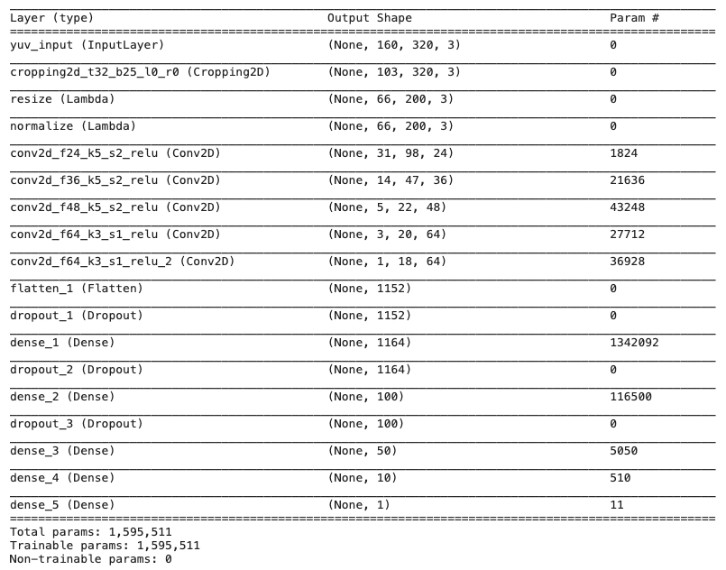
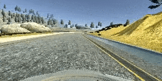
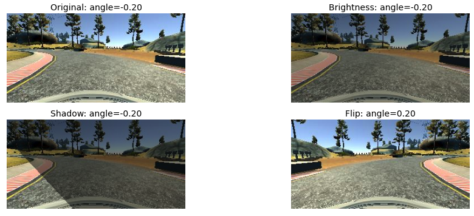
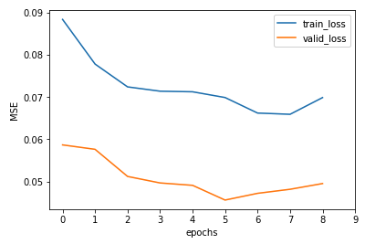
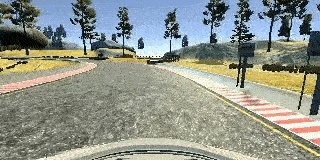

# Project 4 Behavioral Cloning 

## Objectives
The goals / steps of this project are the following:
* Use the simulator to collect data of good driving behavior
* Build, a convolution neural network in Keras that predicts steering angles from images
* Train and validate the model with a training and validation set
* Test that the model successfully drives around track one without leaving the road
* Summarize the results with a written report

## Rubric Points
Here I will consider the [rubric points](https://review.udacity.com/#!/rubrics/432/view) individually and describe how I addressed each point in my implementation.  

### Required files

My project includes the following files:
* `model.py`: containing the script to create and train the model
* `drive.py`: for driving the car in autonomous mode (**modified**)
* `model.h5`: containing a trained convolution neural network (final model)
* `video.mp4`: recording of final model performance on track 1
* `writeup_report.md`: this document, summarizing the results
* `writeup_images`: folder containing images used in the writeup

### Quality of code
Using the Udacity provided simulator and my `drive.py` file, the car can be driven autonomously around the track by executing:
```sh
python drive.py model.h5
```

Please install package prerequisites before running the model.

```bash
pip install -r requirements.txt
```

The `drive.py` script was modified so that the car would move with a top speed of 30mph, where the throttle changed depending on the steering angle outputted by the model.

The `model.py` file contains all the code for training and saving the convolution neural network. The file shows the pipeline I used for training and validating the model, and it contains comments to explain how the code works.

### Model Architecture and Training Strategy

#### Soluton design approach

As a first step, I ran the simulation in manual mode and collect data for analysis, which would be called the [`run1`](./data/run1) dataset. Once I had an idea of what the input data for the model would look like, I then implemented a very simple DNN model (`model.get_simple_dnn()`) just to test the pipeline end-to-end and see how the autonomous car would perform. As expected, it did not perform very well.

I then decided the [check the paper](https://arxiv.org/abs/1604.07316) from Nvidia that was referenced in one of the Udacity lectures and implemented it. The autonomous car performed better, but was still doing poorly on turns. I then decided to implement data augmentation, such as left-right image flip and use of left and right camera images, in order to build a better model. This helped the car perform better in turns.

I also explored another model architecture from [the work of Vivek Yadav](https://chatbotslife.com/using-augmentation-to-mimic-human-driving-496b569760a9#.d779iwp28), where he implemented several different data augmentation techniques, which I also used in my project. A version of his model can be found in `model.get_augment_cnn()`. However, after several experiments, I noticed that the Nvidia-based model was performing better in my case and decided to focus on that instead.

I ran several experiments using the Nvidia CNN architecture, where I was adjusting hyperparameters in order to reduce loss and overfitting, and eventually generate a model that would help the autonomous car stay on the road during simulations. A lot of the effort involved generating new datasets and tweaking data augmentations (see **Training process** for details).

#### Final model architecture

I implemented a modified version of the CNN as described in the [Nvidia paper (Bojarski, et al.)](https://arxiv.org/abs/1604.07316), where a dropout layers after the Flatten layer, as shown below.




<center><em>Model summary of modified Nvidia CNN architecture.</em></center>

The architecture is implemented in `model.get_nvidia_cnn()`.

In the figure above, the Conv2D layer names include the parameters used. For instance, `conv2d_f24_k5_s2_relu`, is a layer with 24 filters, a kernel size of 5x5, 2x2 strides and used ReLU activation. The Cropping2D layer follows a similar convention, where `t32` means a crop from the top of 32 pixels, and `b25` means a crop from the bottom of 25 pixels. The cropping layer is meant to remove unnecessary vertical elements from the image, such as part of the sky and the dashboard.

Prior to the Conv2D layers, the model also performs additional processing on the input YUV images. Aside from the Cropping2D layer mentioned previously, the model also performs image resizing (based on the original paper) and normalization, which uses min-max normalization approach to move pixel values within the range [-1, 1]. 

#### Attempts to reduce overfitting

I experimented with the following approaches to reduce overfitting of the model.

##### Dropout layers

As mentioned previously, the modified Nvidia CNN model contains dropout layers: one before the Flatten layer and one for each of the succeeding Dense layers, for a total of three. The dropout threshold was implemented as a hyperparameter variable that could be modified via command line argument.

##### Diverse datasets

The model was trained and validated on different data sets to ensure that the model was not overfitting. The default datasets to use are defined in `model.DATASETS`, however the list of datasets to use could be changed via command line argument (i.e. `python model.py --datasets`).

The datasets are stored in the `./data` folder and their respective folder names are used as a reference. For instance, the `./data/track1_4laps` folder is referenced in the code as simply `track1_4laps`. See **Training process** for details on datasets that were used for the final model. 

##### Early stopping

When validation loss stops decreasing after a certain number of epochs, training is halted and the model with the lowest validation loss is stored. The epoch threshold, `early_stopping_patience` is configurable as a hyperparameter.


#### Hyperparameter tuning

The table below lists the training hyperparameters that can be changed from the command line.

| Hyperparameter name | Description | Final model value |
| ------------------- | ----------- | ----------------- |
| batch_size          | Training and validation batch size | 32 |
| learning_rate       | Learning rate for optimizer (Adam) | 0.001 |
| num_epochs          | Number of training epochs | 10 (training stopped at epoch 9 due to early stopping) |
| dropout_prob        | Probability of dropping inputs to the next layer | 1.0 |
| use_early_stopping  | If True, implement early stopping | True |
| early_stopping_patience | Number of epochs with no improvement after which training will be stopped (see [Keras EarlyStopping](https://keras.io/api/callbacks/early_stopping/)) |3|
| train_steps | Number of training steps through the data |275|
| valid_steps | Number of validation steps through the data |69|
| angle_correction | Absolute value to add/subtract to steering angle for left/right camera images |0.2|
| augment_threshold | Probability threshold for applying image adjustments (e.g. shift, shadow, brightness) to the image, for data augmentation |0.4|
| clr_probs | Probability of choosing the center, left and right images respectively for each sample in the training set |[0.5, 0.25, 0.25]|

The initial hyperparameters were chosen based on best practices from literature (e.g. batch_size = 32 is a common setting). They were then tweaked depending on the performance of the model after training (i.e. training vs. validation loss plots) and simulation: seeing how the vehicle performs. It turned out that using dropout wasn't really necessary as the model overfitting was avoided by tweaking other settings of the training, such as the datasets used and data preprocessing.

#### Training process

##### Training data

Training data was chosen to keep the vehicle driving on the road, particularly in the center. The table below summarizes all the datasets I had created and used for the final model. 


<center><em> Datasets used for training the final model </em></center>

| Dataset name    | Description                          | Num. samples |
| --------------- | -------------------------------------|--------------|
| track1_4laps    | Four laps around track1                      | 4783 |
| track1_reverse  | One lap around track1 in reverse direction   | 1666 |
| track1_center | Track1 run focusing on the car going back to center of the road  |1799  |
| track2_redo |One-lap around track2 (replacing a previous recording)| 2753 |

The figure below shows an example of center line driving from `track1_4laps`, from the recording of the center camera. I had used a keyboard in order to control the car in manual mode, as this felt more comfortable for me than using a mouse, although this led to some non-smooth turning.


<center><em>Sample run of track1_4laps dataset</em></center>


Similarly, below shows an example of the car moving back to center from `track1_recovery` dataset.


<center><em>Sample run of track1_recovery dataset</em></center>


Below is an example of driving the car around track 2 in `track2_redo`.


<center><em>Sample run of track2_redo dataset</em></center>

For track 2, I decided to drive the car in the right lane instead of the center as with the first iteration of this data recording. After training the model with the first iteration data, I noticed that the car would try to drive over the right lane boundary on track 1, as if it were using that boundary as a guide.

While including data from track 2 would ideally help with overfitting, I noticed that it actually contributed to it (i.e. ratio between validation and training loss increased). This may be because I did not use enough data from track 2 as most of the data that was used to train the model was from track 1.

##### Data preprocessing

The data is read from the CSV file of each dataset and is then shuffled before it is split into training and validation sets (see `model.load_data()`), where 20% goes to the latter. Test data wasn't really necessary for evaluating the model, as that can be done in the simulation, and the data could be easily generated.

In order to increase the variety and number of samples of the training set, data augmentation is also performed. This can be found in `model.preprocess_training_sample()`. First, center, left or right images are randomly chosen based on a given probability distribution `clr_probs` (see **Hyperparameter tuning**). A correction is applied to the angle if either the left or right image is selected.

Then, the image is enhanced if a sample drawn from a uniform distribution between 0 or 1 is greater than the `augment_threshold`. The enhancements used in the final model include brightness adjustment, shadow overlay and horizontal (left-right) image flip. For the latter, the angle is also negated in accordance with the change. The enhancements are applied randomly (e.g. the brighness enhancement can make the image lighter or darker).

The figure below shows examples of the different enhancements mentioned.


<center><em>Data augmentation via random image enhancements. The type of enhancement is shown on top of each image including the angle. The original image on the top-left is taken from the `track1_4laps` dataset. The Flip enhancement reverses the steering angle.</em></center>

No image enhancement or augmentation is performed on the validation data.

For both training and validation data, the image is first converted into YUV colorspace (following the Nvidia paper) before they are passed to the model. Both datasets are passed through the model through Python generators in order to save memory. Using generators also enabled data to be fed indefinitely.

##### Model training and evaluation

Model training and evaluation is implemented in `model.train_and_evaluate()`. The training and validation dataset generators are passed to the Keras model using the `fit_generator` function. An early stopping callback is included to prevent overfitting.

The model uses mean-squared-error (MSE) loss and the Adam optimizer with configurable `learning_rate` . 

After training, the model and its training history (i.e. train/validation loss) is saved. A training summary is also printed for analysis and comparison with previous models.

##### Tuning

The training hyperparameters were tweaked depending on the evaluation metrics (i.e. train/validation MSE loss) and the performance of the model in simulation. Performance improvements in simulation benefitted more from preprocessing and dataset selection than from tuning hyperparameters.

Having a lower validation loss doesn't necessary mean that the model would perform better in the simulation. It was also a bit of a challenge to compare validation losses across different models as the input data was also changing. So the best way to see how the model would perform in simulation was to run the model in the simulation.

The final model achieved a training and validation MSE loss of **0.0699** and **0.0495** respectively on the final epoch. The figure below shows the change in training/validation losses over epochs.


<center><em>Training and validation loss curves for training the final model.</em></center>

As shown in the figure above, training had stopped on the epoch 8 due to the early stopping callback detecting an the uptick in validation loss. The final model actually reflects the model's state at epoch 5, which has the lowest validation loss, due to `restore_best_weights=True` in the callback.

I also ran the model on some test data based on the [sample driving data](https://d17h27t6h515a5.cloudfront.net/topher/2016/December/584f6edd_data/data.zip) from Udacity for this project, which resulted in an MSE loss of **0.0206**.

### Simulation

#### Track 1

Shown below is a sample of final model's performance in track 1. The model was able to successfully navigate the car for at least two laps.


<center><em>Screencast: Autonomous driving using final model on a left and right turns of track 1.</em></center>



<center><em>Center camera view: Autonomous driving using final model on a left and right turns of track 1.</em></center>

The full video recording can be found in `video.mp4` and can also be viewed through [this YouTube link](https://www.youtube.com/watch?v=N1Pnjn8Hze4).

As shown in the images above, the vehicle is able to navigate through turns and go back to center. Initially, I  came up with models that were swaying left and right on the straight paths. My hypothesis was that model was seeing many samples where the angle was not 0.0 (straight). I addressed this by reducing the samples generated per epoch (from 20,000 samples to 8800, which was the total samples in the datasets) and changing `clr_probs` from (0.34, 0.33, 0.33) to (0.50, 0.25, 0.25), effectively doubling the amount of center camera images over the left and right images. For the latter case, even when the car was moving straight, the left and right camera images would still have either a positive or negative steering angle.

In total, I had trained over 73 models before ending up with the final model, as I had experimented with various approaches.

#### Track 2

I also ran the final model in the track 2 simulation, but the autonomous car got stuck before the first hairpin turn. The model was only trained on a limited amount of track 2 data (one lap), and additional track 2 data may help improve performance. This is left as future work.

## Conclusion and future work

The final model, which used the [Nvidia CNN architecture](https://arxiv.org/abs/1604.07316), was able to navigate the autonomous vehicle around the track 1 simulation. However, there is still a lot of room for improvement with getting the model to steer the car in a smoother way.

Ideas for future work include:

- Using transfer learning to re-train a more sophisticated model such as GoogLeNet on the behavioral cloning problem
- Training a model with more track 2 data
- Using hyperparameter tuning methods (e.g. Bayesian optimization) to reduce validation loss


## References

Udacity project: https://github.com/udacity/CarND-Behavioral-Cloning-P3

I referenced the following related work in developing the model for this project.

- https://images.nvidia.com/content/tegra/automotive/images/2016/solutions/pdf/end-to-end-dl-using-px.pdf
- https://chatbotslife.com/using-augmentation-to-mimic-human-driving-496b569760a9#.d779iwp28
- https://github.com/naokishibuya/car-behavioral-cloning
