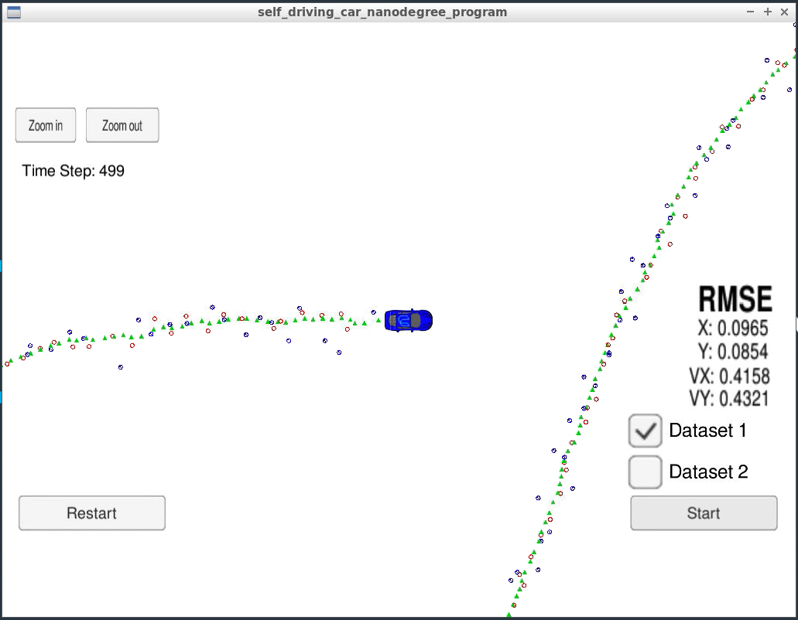

# Project 4 Behavioral Cloning 

## Objective
- Implement an extended kalman filter to estimate the state of a moving object of interest with noisy lidar and radar measurements
- Final root-mean-squared error (RMSE) based on ground truth data for [x-position, y-position, x-velocity, y-velocity] should be less than or equal to {0.11, 0.11, 0.52, 0.52} respectively on dataset 1.

## Files
The implementation code is in the `src` folder.

## Results
Achieved final RMSE of ~{0.10, 0.09. 0.42, 0.43}.

## References
Udacity project: https://github.com/udacity/CarND-Extended-Kalman-Filter-Project
