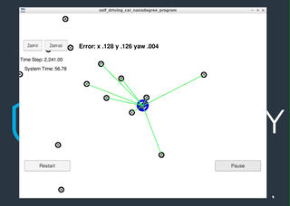

# Project 6 Kidnapped Vehicle (Particle Filter)

## Objective
The aim of this project is to implement a two-dimensional particle filter in C++ for localizing a vehicle in a map using observed landmarks. The particle filter will be given a map and some initial localization information, similar to GPS coordinates. At each time step, the filter will also receive observation and control data.

See the link in the **References** section for more info.

## Files
The files I modified from the [base project code](https://github.com/udacity/CarND-Kidnapped-Vehicle-Project/tree/master/src) are located in the `src` folder.

## Results
The particle filter was able to complete 2,443 timesteps in 62.24 seconds with a mean RSME in the x, y and yaw (heading) positions of 0.128, 0.127 and 0.004 respectively. 

*Full recording can be found [here](https://youtu.be/AVoOpbdOSfU).*

## References
Udacity project: https://github.com/udacity/CarND-Kidnapped-Vehicle-Project

