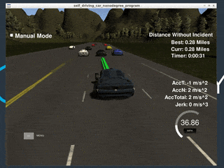

## P7: Highway driving (path planning)

## Objective

The goal of this project is to implement a path planning algorithm in C++ to safely navigate a car around a virtual highway with other traffic that is driving +-10 MPH of the 50 MPH speed limit.

## Usage

Check out the Udacity [project repo](https://github.com/udacity/CarND-Path-Planning-Project) on path planning and copy (overwrite) the following files there:

- [`src/`](./src)
- [`CMakeLists.txt`](./CMakeLists.txt)

Refer to the Udacity project's README for instructions on how to compile and run the code in the simulator.

## Rubric points

The following criteria need to be met in order to complete the project:

- The car is able to drive at least **4.32** miles without incident.
- The car drives within the speed limit (*50MPH*).
- Max acceleration (**10 m/s<sup>2</sup>**) and jerk (**10 m/s<sup>3</sup>**) are not exceeded.
- Car has **0** collisions
- The car stays in its lane, except for the time between changing lanes.
- The car is able to change lanes (e.g. when vehicle ahead is too slow)

[This video](https://www.youtube.com/watch?v=u69gBEt4pOc) shows that the path planner is able to achieve all of the rubric points beyond 4.32 miles of simulated driving. While the vehicle is able to meet all the rubric requirements, emphasizing safety, it currently does not always choose the fastest lane.

<p align="center">
  <br>
  <em>Ego car navigating through traffic in a stretch of road using the path planner.</em>
</p>

## Methodology

### Data

#### Vehicle
The simulator sends telemetry such as the ego car's localization information and predicted signals from other nearby vehicles using simulated sensor fusion to the path planning program.

Vehicle telemetry:
- `x`: Predicted x-coordinate of ego car
- `y`: Predicted y-coordinate of ego car
- `s`: Frenet *s* coordinate of ego car
- `d`: Frenet *d* coordinate of ego car
- `yaw`: Vehicle heading
- `speed`: Vehicle speed
- `previous_path_x`: Remaining x-coordinates of previous trajectory
- `previous_path_y`: Remianing y-coordinates of previous trajectory
- `end_path_s`: The last s coordinate of the previous trajectory
- `end_path_d`: The last d coordinate of the previous trajectory
- `sensor_fusion`: Data from other sensed vehicles

Sensed vehicle telemetry:
- `x`: Predicted x-coordinate of sensed vehicle
- `y`: Predicted y-coordinate of sensed vehicle
- `s`: Frenet *s* coordinate of sensed vehicle
- `d`: Frenet *d* coordinate of sensed vehicle
- `id`: Unique identifier for sensed vehicle
- `vx`: Sensed vehicle velocity along x map axis
- `vy`: Sensed vehicle velocity along y map axis

#### Highway map

The track  consists of 6 lanes, with 3 lanes on the right hand side (forward), 3 on the left (reverse) forming two-way traffic. Each lane is  4 m wide. The length of the track is 6945.554 m (4.32 mi). For car averaging 50 mph, should take a little more than 5 min to go around the track. The car should only take on one the 3 lanes in the right hand side. 

[Map waypoints](https://github.com/udacity/CarND-Path-Planning-Project/blob/master/data/highway_map.csv) are also provided, which are placed along the center of the highway. There are 181 waypoints in total, with the last waypoint mapping back around to the first. Each waypoint is a set of {x, y, s, d} values, with the first waypoint having s = 0. The magnitude of `d` = 1 and `d` points perpendicular to road in the direction of right hand side of the road.

#### Timing

The simulator runs a cycle every 20 ms (50 frames/second). The path planning program will provide a new path at least one 20 ms cycle behind (previous cycle). Smooth transition are important (connect previous path with new path) to avoid jerk.

### Output

The path planning program should generate trajectories as vectors of x,y coordinates that will be sent back to the simulator.

```c++
vector<double> x_vals;
vector<double> y_vals;
...
msgJson["next_x"] = x_vals;
msgJson["next_y"] = y_vals;
```
### Path planning algorithm

The aim of the path planning algorithm is to generate the appropriate target lane and velocity parameters for generating the trajectory at every cycle (i.e. when the simulator send new telemetry data). The implementation is split between `main.cpp` file and the `vehicle.h` and `vehicle.cpp` files found in the [`src`](./src) folder.

#### `main.cpp`

The top-level logic of the path planner is contained in the following code snippet in `main.cpp`:

```c++
         if (car.VehicleInFrontTooClose()) {
            if (lane > 0 && car.LeftLaneClear()) {
              // Move left if clear
              lane -= 1;
            } else if (lane < 2 && car.RightLaneClear()) {
              // Move right if clear
              lane += 1;
            } else {
              // Slow down
              ref_vel -= 0.224;
            }
          } else {
            if (ref_vel < 49.5) {
              // Slowly accelerate if below target velocity (useful for cold start)
              ref_vel += 0.224;
            }
          }

          // Get a trajectory based on target lane and velocity
          Trajectory trajectory = getTrajectory(
              lane, ref_vel, car, map_waypoints);
```

The vehicle's trajectory is govered by two parameters: `lane` and `ref_vel` (MPH) which indicate the target highway lane and velocity that the ego car must achieve.The lanes are mapped to integers 0, 1 and 2 for the leftmost, center and rightmost lanes of where the ego is facing respectively. 

At each telemetry cycle, the algorithm checks if the vehicle in the same lane ahead is too close. If it is, then the algorithm will check if it is possible to move the left, and will do so (set `lane -= 1`) if the ego car is not in the leftmost lane (`lane = 0`) and the left lane is clear. Otherwise, the algorithm will check if it is clear to pass the right lane, setting `lane += 1` if it is true. If neither case is true, the car will simply slow down (`ref_vel -= 0.224`) to avoid hitting the car ahead.

If the vehicle ahead is not too close, which should be most cases, the algorithm will check if the car has reached the target velocity (slightly below 50MPH to be safe). If it is not, it will slowly increase the velocity (`ref_vel`) at a constant acceleration of ~5m/s<sup>2</sup>.

Once the `lane` and `rev_vel` parameters have been determined, the trajectory is generated using `getTrajectory`, which outputs a `Trajectory` object that contains a vector of `x_vals` and `y_vals`, specify the next pair of x, y coordinate points that the car must follow. At most 50 points are generated in every telemetry cycle.

The methods `car.VehicleInFrontTooClose()`, `car.LeftLaneClear()` and `car.RightLaneClear()` are implemented in the `EgoVehicle` class, which can be found in [`vehicle.cpp`](./src/vehicle.cpp).

#### vehicle.h and vehicle.cpp

These files implement the rest of the path planner code. The ego car is represented by the `EgoVehicle` class while the other vehicles detected by the ego car's sensors are represented by the `SensedVehicle` class. Both of these classes inherit from the`Vehicle`class, which provides common attributes such as `x`, `y`, `s` and `d` coordinates.

The following describes in more detail the pertinent methods called from `main.cpp`.

##### EgoVehicle::VehicleInFrontTooClose()

This method returns a boolean true value if the projected Frenet s-distance between the ego car and the vehicle in front of it in the same lane is smaller than a given threshold, which defaults to a `kMinGap=30` meters (prefix "k" is used to indicate that the value is fixed for the duration of the program as per the [Google C++ style guide](https://google.github.io/styleguide/cppguide.html#Constant_Names)). 

The method simply calls a more generic `VehicleTooCloseProjected()` method that checks the relative proximity (in terms of s-distance) of vehicles in front or behind the ego car (in terms of s) at any lane.

##### EgoVehicle::VehicleTooCloseProjected()

This checks whether a sensed vehicle in a particle lane is too close. The user can specify whether they want to check a vehicle ahead (`ahead=true`) or behind (`ahead=false`), and the target lane to check. In either case, the closest vehicle ahead or behind in a target lane is determined by the `EgoVehicle::getVehicleNearby()` method.

To determine "closeness," the projected s-position of the nearby vehicle is compared with that of the ego car. 

If there are still points in the previous trajectory, that the `projected_s` of the ego car is set to the ending s-coordinate of the previous trajectory. Otherwise, it is set to the ego car's current `s` coordinate.

The projected s-position of the nearby vehicle, `projected_other_s`, is determined based on its speed and the remaining points in the previous car's trajectory, which indicate the time it would take for the ego car to reach its `projected_s` position. The `projected_other_s` value is determined by the following formula code snippet:

```c++
double projected_other_s = (
    vehicle_nearby->s + ((double) prev_size * 0.02 * speed));
```
where:
- `vehicle_nearby->s`: the nearby vehicle's predicted current `s` position
-  `prev_size`: the remaining points in the ego car's previous trajectory
-  `speed`: the magnitude of the x and y-axis velocities of the nearby vehicle

If the absolute distance between `projected_other_s` and `projected_s` is less than the given threshold, then the method returns `true`. Otherwise, it will return `false`.

##### EgoVehicle::getVehicleNearby()

This method returns the closest detected vehicle either in front or behind the ego car at a given lane. Each sensed vehicle is checked to see if it within the `target_lane` specified. To filter for vehicles ahead or behind, the sensed vehicle's `s` coordinate is compared with that of the ego car's. Euclidean distances along the x-y plane are then computed between the ego car and the remaining sensed vehicles, and the sensed vehicle that has the smallest distance would be returned.


##### EgoVehicle::LeftLaneClear() and EgoVehicle::.RightLaneClear()

These methods determine whether the ego car would be able to turn to either the left and right lane respectively. If the ego car is in the leftmost lane (`lane=0`), then `EgoVehicle::LeftLaneClear()` would immediately return `false` as the area to the left should not be traversed. Similarly, if the ego car is in the rightmost lane (`lane==2`), then `EgoVehicle::RightLaneClear()` would immediately return `false` since that area would be outside the road.

If the aforementioned conditions do not hold, both methods will call the `EgoVehicle::LaneClear()` method, passing in their respective target lanes (e.g. `lane - 1` for left lane change).


##### EgoVehicle::LaneClear()

This method returns `true` is a given target lane is clear based on the following criteria:

1. Vehicle ahead of ego car in target lane is not too close based on projected `s` positions
2. Vehicle behind ego car in target lane is not too close `s` positions
3. There are no vehicles that are too close to the ego car in the target lane

For 1. and 2., the method checks whether `EgoVehicle::VehicleTooCloseProjected()` is `true` for either `ahead=true` or `ahead=false` cases respectively, with the current threshold fixed to `kMinGap=30` meters. If either one is `true`, this method returns `false`. Otherwise, this would assume the lane is clear and it returns `true`


## Trajectory generation

The ego car's trajectory, represented by a set of x,y coordinate points, is generated by [`./src/trajectory.cpp:getTrajectory()`](./src/trajectory.cpp). The function uses a spline to generate trajectories that are guaranteed to be smooth. 

To generate a spline, reference x,y points would need to be determined. If the number of remaining (unvisited) x,y points in the previous trajectory is less than two, then the initial reference points will be taken from the car's current position and an estimate of it's prior position based on it's current heading (yaw). Otherwise, The last two points of the previous trajectory will be used as initial reference points.

To remaining reference points are generated using projectioed x,y coordinates at 30, 60 and 90m from the ego car's current position. This can be generated by taking the Frenet coordinates at `s = {30, 60, 90}` respectively and `d = 2 + 4*lane`, where `lane` is the lane index, `4` is the lane width in meters and `2` is the offset to get to the center of the lane. The coordinates are then converted into x,y coordinates and added as reference points.

To make spline computation easier, the reference points are shifted from map coordinates to vehicle coordinates. The number of spline points to generated is determined by the target distance from the vehicle at 30m in the forward (x) direction, the update rate (20ms) and target velocity:
```c++
double N = target_dist/(0.02*target_velocity/2.24);
```

where `target_dist` is the straight line distance from the ego car's current position to its x,y position after 30m (y = spline(x=30m)), and `2.24` is a conversion factor from MPH to m/s.

At most `N` points are generated. If there are still remaining points in the previous trajectory (`previous_path_*`), those are reused in the new directly and subtracted from the points to be generated using the spline. The spline points are converted back into map coordinates before they are added to the new trajectory.

## Reflection
The path planning program was able to guide the ego car around the highway while adhering to the constraints defined in the rubric. However, there is definitely still room for improvement. The ego car may still attempt to make a [risky lane change](https://www.youtube.com/watch?v=pvab5TLucZI&t=0m57s) where the clearance between cars in front and behind the ego car in the target lane is small. This may be due to the timing lag between the path planning program and the simulator, where the former provides a new path to the latter at least one cycle (20ms) behind. Also, there is still the possibility of the ego car getting into an incident as not all possible corner cases could be assessed in the simulation runs conducted.

Future work can involve use of cost functions to determine the best trajectory parameters to use (i.e. target lane and velocity) and would consider proximity of other cars in various lanes as well as an estimate of how fast the ego car could potentially travel in each lane for a certain stretch.

## References

- Udacity path planning project [Q&A session video](https://www.youtube.com/watch?v=7sI3VHFPP0w)

