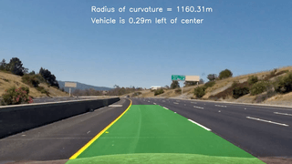
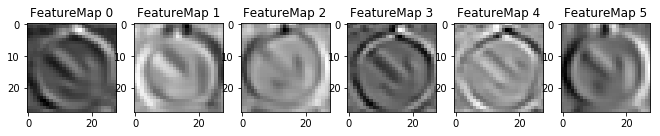
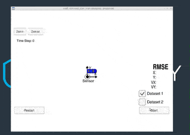

# Udacity Self-Driving Car Nanodegree

This repository contains solutions to projects in the [Udacity Self-Driving Car Nanodegree course](https://www.udacity.com/course/self-driving-car-engineer-nanodegree--nd013).

## Projects

### Finding lane lines using computer vision

Image processing pipeline for identifying road lane lines from an image depicting the driver's side view of the road from inside a car.

<em>Output of lane finding pipeline on sample video clip.</em>

### Advanced lane finding

More advanced image processing pipeline that detects lane lines and computes radius of curvature of the lane and vehicle's offset from center of the lane. The camera images are first undistored based on computed camera parameters from test checkboard images.

<em>Output of advanced lane finding pipeline on sample video clip.</em>

### Traffic sign classifier using CNNs

CNN classifier based on the [LeNet architecture](http://yann.lecun.com/exdb/publis/pdf/lecun-01a.pdf) for identifying German traffic signs. The model was trained on a subset of the [German Traffic Sign Dataset](http://benchmark.ini.rub.de/?section=gtsrb&subsection=dataset), and achieved a test set accuracy of 94.7%.

<em>Feature map outputted by first convolution layer for a "keep right" traffic sign image.</em>

### Behavioral cloning for autonomous driving

Behavioral cloning (regression) model based on the [NVIDIA paper (Bojarski et al. 2016)](https://arxiv.org/abs/1604.07316). Model was trained on recordings of manually-driven car around simulated tracks using the Udacity driving simulator.

<em>Screencast of autonomous driving on track 1 simulation.</em>

### Sensor fusion with extended kalman filter

Extended kalman filter for tracking the position of a moving vehicle in simulation using LIDAR and radar data.

<em>Screencast EKF simulation on dataset1.</em>

## Directories
- [`P1_lane_finding`](./P1_lane_finding): Finding lane lines
- [`P2_adv_lane_finding`](./P2_adv_lane_finding): Advanced lane finding
- [`P3_traffic_sign_classifier`](./P3_traffic_sign_classifier): Traffic sign classifier
- [`P4_behavioral_cloning`](./P4_behavioral_cloning): Behavioral cloning for autonomous driving
- [`P5_extended_kalman_filter`](./P5_extended_kalman_filter): Extended Kalman filter in C++

## License
[Apache 2.0](./LICENSE)

